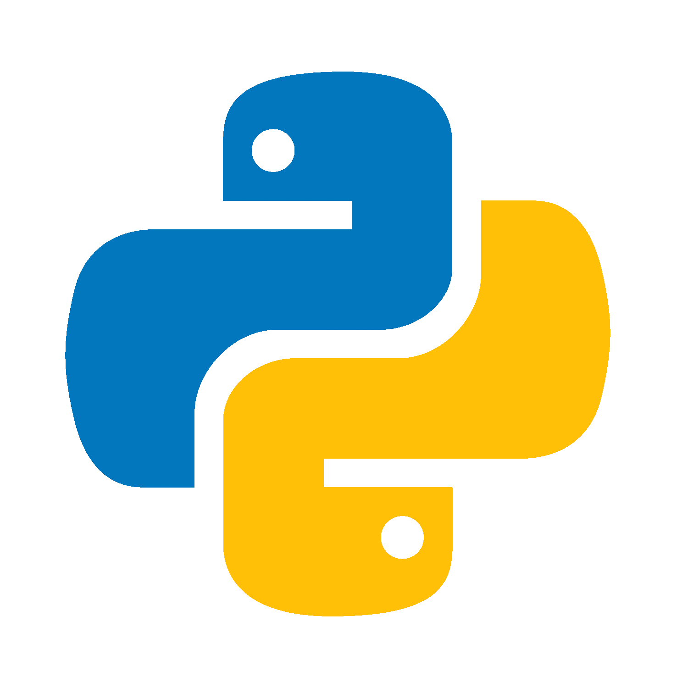
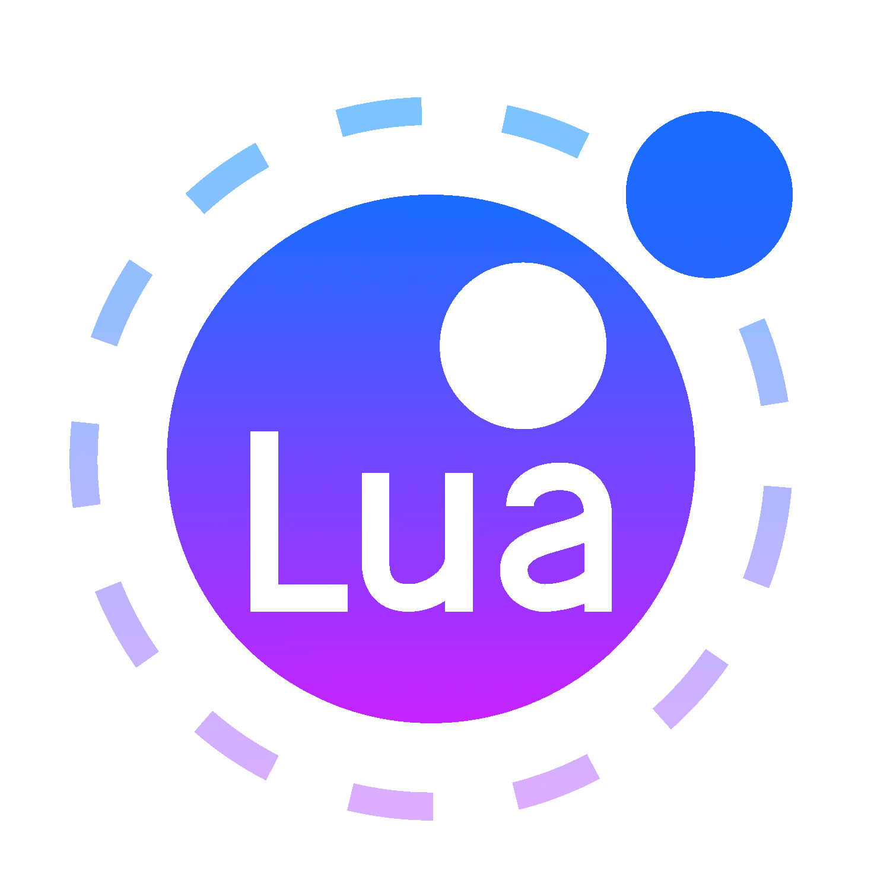
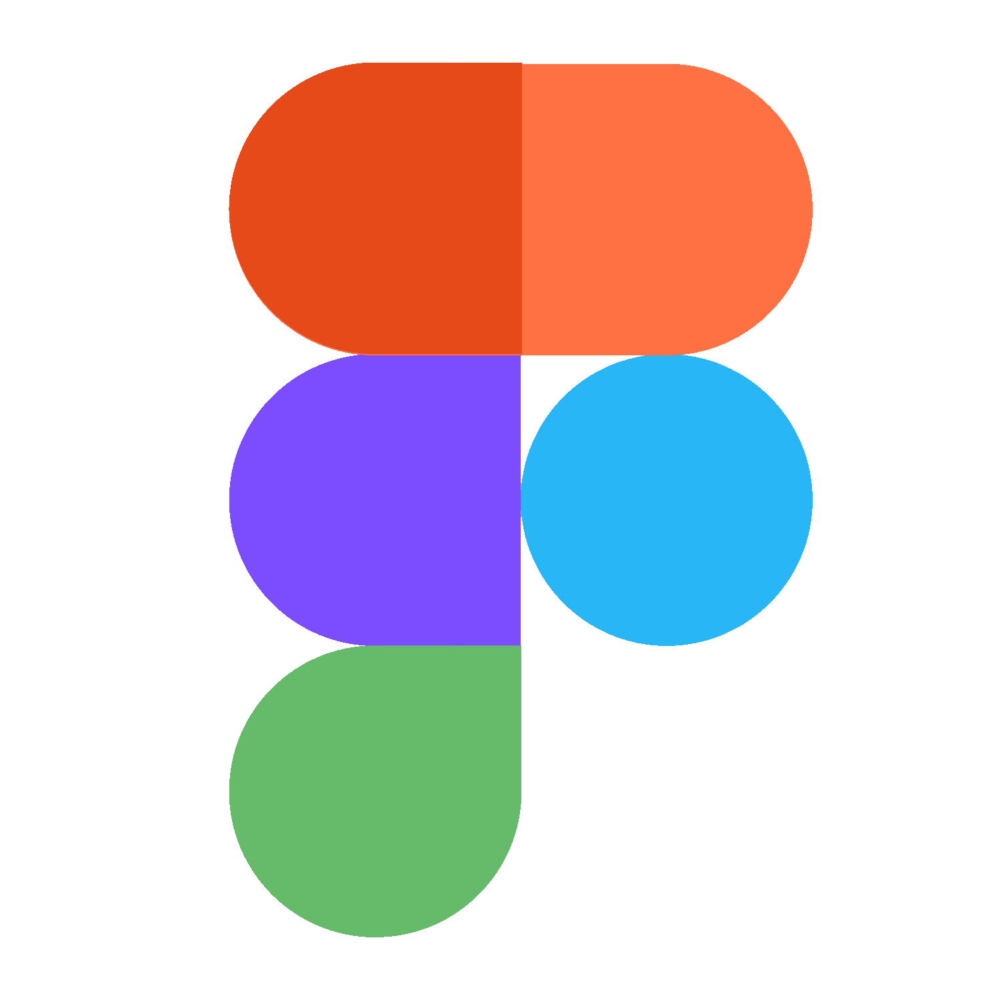

<!-- Welcome Section -->
<h2 align="center">Bienvenue sur mon profil 👋</h2>


<!-- About Me Section -->
<h2 align="center">🏷️ À propos de moi</h2>

Je m'appelle Milwenn FRANCEUS-COINTREL, j'ai actuellement 19 ans et je suis étudiant en 2ème année de BUT Informatique à l'IUT de Montpellier-Sète.

Passionné par l'informatique depuis mon plus jeune âge, de par les jeux vidéo et leurs possibilités gargantuesques de modding, mon intérêt envers le développement s'est fait naturellement. C'est vers l'âge de mes 10 ans sur le jeu vidéo [Minecraft](https://www.minecraft.net/), que j'ai découvert que l'on pouvait faire tout ce que l'on souhaitait via l'API [Bukkit](https://dev.bukkit.org/) et le langage de programmation Java. Ce fut un véritable déclic : cette ${\color{Orange}\large\textsf{flamme}}\$ allumée en moi depuis ce jour, m'a éveillé ma curiosité et ma soif d'apprendre toutes sortes de technologies lors de mon temps libre; des heures et des journées entières à **imaginer**, **coder**, **tester**, et surtout **apprendre de mes erreurs**.

Étant **déterminé** et **perfectionniste** dans mes tâches depuis mon enfance, cette approche m'a été de nombreuses fois un atout, me permettant constamment de progresser et de renforcer mes compétences, même si ce perfectionnisme peut parfois devenir un petit défi à surmonter.

Ayant fait un baccalauréat général avec **Mathématiques** et **Numérique et Sciences Informatiques** comme spécialités, je me suis orienté vers un **BUT Informatique** pour me focaliser dans le développement : le BUT est une formation comprenant un parfait compromis entre **théorie** et **pratique** où la pratique est largement mise en évidence, c'est ce qui m'a amené à choisir cette formation. Je souhaiterais à la fin de mon BUT me spécialiser via un **Master**, pour améliorer au maximum mes compétences dans ce domaine.

**À l'heure d'aujourd'hui**, j'ai réussi ma première année avec une moyenne de **14,55** : je passe en seconde année avec le parcours **RACDV** _(Réalisation d'Applications : Conception, Développement, Validation)_.


<!-- Skills Section -->
<h2 align="center">🛠️ Mes compétences</h2>

<h3 align="center">Développement Web</h3>

<div align="center">
  <table>
    <thead>
      <tr>
        <th align="center" colspan="3">Front-end</th>
        <th align="center" colspan="2">Back-end</th>
      </tr>
    </thead>
    <tbody>
      <tr>
        <td align="center">
          <a href="https://developer.mozilla.org/fr/docs/Glossary/HTML5/">
            
          </a>
          <br>HTML5
        </td>
        <td align="center">
          <a href="https://developer.mozilla.org/fr/docs/Web/CSS/">
            
          </a>
          <br>&nbspCSS3&nbsp
        </td>
        <td align="center">
          <a href="https://developer.mozilla.org/fr/docs/Web/JavaScript/">
            
          </a>
          <br>JavaScript
        </td>
        <td align="center">
          <a href="https://nodejs.org/">
            
          </a>
          <br>Node.js
        </td>
        <td align="center">
          <a href="https://www.php.net/">
            
          </a>
          <br>&nbsp&nbsp&nbsp&nbspPHP&nbsp&nbsp&nbsp&nbsp
        </td>
      </tr>
    </tbody>
  </table>
</div>

<h3 align="center">Développement Général</h3>

<div align="center">
  <table>
    <thead>
      <tr>
        <th align="center" colspan="4">Haut niveau</th>
        <th align="center" colspan="1">Bas niveau</th>
      </tr>
    </thead>
    <tbody>
      <tr>
        <td align="center">
          <a href="https://www.java.com/">
            
          </a>
          <br>&nbsp&nbspJava&nbsp&nbsp
        </td>
        <td align="center">
          <a href="https://learn.microsoft.com/fr-fr/dotnet/csharp/">
            
          </a>
          <br>&nbsp&nbsp&nbspC#&nbsp&nbsp&nbsp
        </td>
        <td align="center">
          <a href="https://www.python.org/">
            
          </a>
          <br>Python
        </td>
        <td align="center">
          <a href="https://lua.org/">
            
          </a>
          <br>&nbsp&nbsp&nbspLua&nbsp&nbsp&nbsp
        </td>
        <td align="center">
          <a href="https://www.learn-c.org/">
            
          </a>
          <br>C
        </td>
      </tr>
    </tbody>
  </table>
</div>

<h3 align="center">Développement Base de données</h3>

<div align="center">
  <table>
    <thead>
      <tr>
        <th align="center" colspan="2">Relationelle</th>
        <th align="center" colspan="2">Autre</th>
      </tr>
    </thead>
    <tbody>
      <tr>
        <td align="center">
          <a href="https://www.mysql.com/">
            
          </a>
          <br>MySQL
        </td>
        <td align="center">
          <a href="https://www.oracle.com/database/">
            
          </a>
          <br>Oracle SQL
        </td>
        <td align="center">
          <a href="https://www.json.org/">
            
          </a>
          <br>JSON
        </td>
        <td align="center">
          <a href="https://yaml.org/">
            
          </a>
          <br>YAML
        </td>
      </tr>
    </tbody>
  </table>
</div>

<h3 align="center">DevOps</h3>

<div align="center">
  <table>
    <thead>
      <tr>
        <th align="center" colspan="1">Infrastructure</th>
        <th align="center" colspan="1">Test</th>
      </tr>
    </thead>
    <tbody>
      <tr>
        <td align="center">
          <a href="https://www.docker.com/">
            
          </a>
          <br>Docker
        </td>
        <td align="center">
          <a href="https://junit.org/junit5/">
            
          </a>
          <br>JUnit
        </td>
      </tr>
    </tbody>
  </table>
</div>

<h3 align="center">Outils</h3>

<div align="center">
  <table>
    <thead>
      <tr>
        <th align="center" colspan="6">Collaboration</th>
        <th align="center" colspan="5">Service</th>
      </tr>
    </thead>
    <tbody>
      <tr>
        <td align="center">
          <a href="https://git-scm.com/">
            
          </a>
          <br>&nbsp&nbsp&nbspGit&nbsp&nbsp&nbsp
        </td>
        <td align="center">
          <a href="https://github.com/">
            
          </a>
          <br>GitHub
        </td>
        <td align="center">
          <a href="https://gitlab.com/">
            
          </a>
          <br>GitLab
        </td>
        <td align="center">
          <a href="https://www.figma.com/">
            
          </a>
          <br>Figma
        </td>
        <td align="center">
          <a href="https://workspace.google.com/">
            
          </a>
          <br>Workspace
        </td>
        <td align="center">
          <a href="https://discord.com/">
            
          </a>
          <br>Discord
        </td>
        <td align="center">
          <a href="https://www.kernel.org/">
            
          </a>
          <br>&nbspLinux&nbsp
        </td>
        <td align="center">
          <a href="https://maven.apache.org/">
            
          </a>
          <br>Maven
        </td>
        <td align="center">
          <a href="https://gradle.org/">
            
          </a>
          <br>Gradle
        </td>
        <td align="center">
          <a href="https://nginx.org/">
            
          </a>
          <br>&nbspNginx&nbsp
        </td>
        <td align="center">
          <a href="https://httpd.apache.org/">
            
          </a>
          <br>Apache
        </td>
      </tr>
    </tbody>
  </table>
</div>

<h3 align="center">Environnement de développement (IDE)</h3>

<div align="center">
  <table>
    <thead>
      <tr>
        <th align="center" colspan="6">Jetbrains</th>
        <th align="center" colspan="1">Autre</th>
      </tr>
    </thead>
    <tbody>
      <tr>
        <td align="center">
          <a href="https://www.jetbrains.com/fr-fr/idea/">
            
          </a>
          <br>IntelliJ IDEA
        </td>
        <td align="center">
          <a href="https://www.jetbrains.com/fr-fr/phpstorm/">
            
          </a>
          <br>PhpStorm
        </td>
        <td align="center">
          <a href="https://www.jetbrains.com/fr-fr/rider/">
            
          </a>
          <br>&nbspRider&nbsp
        </td>
        <td align="center">
          <a href="https://www.jetbrains.com/fr-fr/clion/">
            
          </a>
          <br>&nbspCLion&nbsp
        </td>
        <td align="center">
          <a href="https://www.jetbrains.com/fr-fr/pycharm/">
            
          </a>
          <br>PyCharm
        </td>
        <td align="center">
          <a href="https://www.jetbrains.com/fr-fr/datagrip/">
            
          </a>
          <br>DataGrip
        </td>
        <td align="center">
          <a href="https://code.visualstudio.com/">
            
          </a>
          <br>VS Code
        </td>
      </tr>
    </tbody>
  </table>
</div>


<!-- Projects Section -->
<h2 align="center">💻 Mes projets</h2>

> [!NOTE]
> La liste ci-dessous contient uniquement les projets que j'estime pouvoir être publique.

<br>
<h3>BUT 1 – Première année</h3>
Les dépôts ci-dessous correspondent aux différents TDs et projets que j'ai pu effectuer lors de ma première année au sein du BUT Informatique.

<h4>1er semestre</h4>
<details>
  <summary><strong>SAÉ – Situation d'Apprentissage et d'Évaluation
    
    
    
    
  </strong></summary>
  <br>
  <div align="center">
    <a href="https://github.com/JumperBoost/A1-SAE1.01"></a>
    <a href="https://github.com/JumperBoost/A1-SAE1.02"></a>
    <a href="https://github.com/JumperBoost/A1-SAE1.04"></a>
    <a href="https://github.com/JumperBoost/A1-SAE1.05"></a>
    <a href="https://github.com/JumperBoost/A1-SAE1.06"></a>
  </div>
</details>

<h4>2ème semestre</h4>
<details>
  <summary><strong>SAÉ – Situation d'Apprentissage et d'Évaluation
    
    
    
    
    
    
    
  </strong></summary>
  <div align="center">
    <h5>SAÉ Trains (SAÉ 2.01/2.02)</h5>
    <a href="https://github.com/JumperBoost/A1-SAETrains-Phase1"></a>
    <a href="https://github.com/JumperBoost/A1-SAETrains-Phase2"></a>
    <a href="https://github.com/JumperBoost/A1-SAETrains-Phase3"></a>
    <br>
    <a href="https://github.com/JumperBoost/A1-SAE2.03"></a>
    <a href="https://github.com/JumperBoost/A1-SAE2.04"></a>
  </div>
</details>
<details>
  <summary><strong>Réseau Bas Niveau 
    
  </strong></summary>
  <br>
  <div align="center">
    <a href="https://github.com/JumperBoost/A1-ReseauBasNiveau-TD1"></a>
    <a href="https://github.com/JumperBoost/A1-ReseauBasNiveau-TD2"></a>
    <a href="https://github.com/JumperBoost/A1-ReseauBasNiveau-TD3"></a>
    <a href="https://github.com/JumperBoost/A1-ReseauBasNiveau-TD4"></a>
    <a href="https://github.com/JumperBoost/A1-ReseauBasNiveau-TD5"></a>
  </div>
</details>
<details>
  <summary><strong>Développement Orienté Objets
    
    
  </strong></summary>
  <br>
  <div align="center">
    <a href="https://github.com/JumperBoost/A1-DevObjets-TP1"></a>
    <a href="https://github.com/JumperBoost/A1-DevObjets-TP2"></a>
    <a href="https://github.com/JumperBoost/A1-DevObjets-TP3"></a>
    <a href="https://github.com/JumperBoost/A1-DevObjets-TP4"></a>
    <a href="https://github.com/JumperBoost/A1-DevObjets-TP5"></a>
    <a href="https://github.com/JumperBoost/A1-DevObjets-TP6"></a>
    <a href="https://github.com/JumperBoost/A1-DevObjets-TP7"></a>
    <a href="https://github.com/JumperBoost/A1-DevObjets-TP8"></a>
    <a href="https://github.com/JumperBoost/A1-DevObjets-TP9"></a>
    <a href="https://github.com/JumperBoost/A1-DevObjets-TP10"></a>
  </div>
</details>
<details>
  <summary><strong>IHM – Interface Homme-Machine
    
    
  </strong></summary>
  <br>
  <div align="center">
    <a href="https://github.com/JumperBoost/A1-IHM-TP1"></a>
    <a href="https://github.com/JumperBoost/A1-IHM-TP2"></a>
    <a href="https://github.com/JumperBoost/A1-IHM-TP3"></a>
  </div>
</details>
<br>
<h3>BUT 2 – Deuxième année</h3>

> [!NOTE] 
> La deuxième année n'étant pas terminée, peu de dépôt sont disponible publiquement. Cependant, la liste des projets ci-dessous est mis à jour régulièrement.

<h4>3ème semestre</h4>
<details>
  <summary><strong>Développement web PHP
    
    
    
    
  </strong></summary> 
  <br>
  <a href="https://github.com/JumperBoost/A2-DevWeb-TDs"></a>
</details>

<h2 align="center">📊 Statistiques</h2>
  
> [!IMPORTANT]
> Les statistiques [WakaTime](https://wakatime.com/@JumperBoost) ci-dessous ne concernent qu'à partir du 29 septembre 2024.

<div>
  <!--START_SECTION:waka-->

```rust
From: 18 November 2023 - To: 17 November 2024

Total Time: 185 hrs 15 mins

PHP               103 hrs 20 mins ⣿⣿⣿⣿⣿⣿⣿⣿⣿⣿⣿⣿⣿⣿⣀⣀⣀⣀⣀⣀⣀⣀⣀⣀⣀   55.78 %
SQL               22 hrs 54 mins  ⣿⣿⣿⣄⣀⣀⣀⣀⣀⣀⣀⣀⣀⣀⣀⣀⣀⣀⣀⣀⣀⣀⣀⣀⣀   12.37 %
Python            11 hrs 59 mins  ⣿⣶⣀⣀⣀⣀⣀⣀⣀⣀⣀⣀⣀⣀⣀⣀⣀⣀⣀⣀⣀⣀⣀⣀⣀   06.47 %
Markdown          10 hrs 57 mins  ⣿⣦⣀⣀⣀⣀⣀⣀⣀⣀⣀⣀⣀⣀⣀⣀⣀⣀⣀⣀⣀⣀⣀⣀⣀   05.92 %
CSS               10 hrs 19 mins  ⣿⣤⣀⣀⣀⣀⣀⣀⣀⣀⣀⣀⣀⣀⣀⣀⣀⣀⣀⣀⣀⣀⣀⣀⣀   05.57 %
Java              8 hrs 31 mins   ⣿⣄⣀⣀⣀⣀⣀⣀⣀⣀⣀⣀⣀⣀⣀⣀⣀⣀⣀⣀⣀⣀⣀⣀⣀   04.60 %
C                 6 hrs 8 mins    ⣷⣀⣀⣀⣀⣀⣀⣀⣀⣀⣀⣀⣀⣀⣀⣀⣀⣀⣀⣀⣀⣀⣀⣀⣀   03.32 %
HTML              2 hrs 55 mins   ⣤⣀⣀⣀⣀⣀⣀⣀⣀⣀⣀⣀⣀⣀⣀⣀⣀⣀⣀⣀⣀⣀⣀⣀⣀   01.58 %
```

<!--END_SECTION:waka-->
  <div align="center">
    <a href="https://github.com/JumperBoost?tab=repositories"></a>
  </div>
</div>

<!--
**JumperBoost/JumperBoost** is a ✨ _special_ ✨ repository because its `README.md` (this file) appears on your GitHub profile.

Here are some ideas to get you started:

- 🔭 I’m currently working on ...
- 🌱 I’m currently learning ...
- 👯 I’m looking to collaborate on ...
- 🤔 I’m looking for help with ...
- 💬 Ask me about ...
- 📫 How to reach me: ...
- 😄 Pronouns: ...
- ⚡ Fun fact: ...
-->
